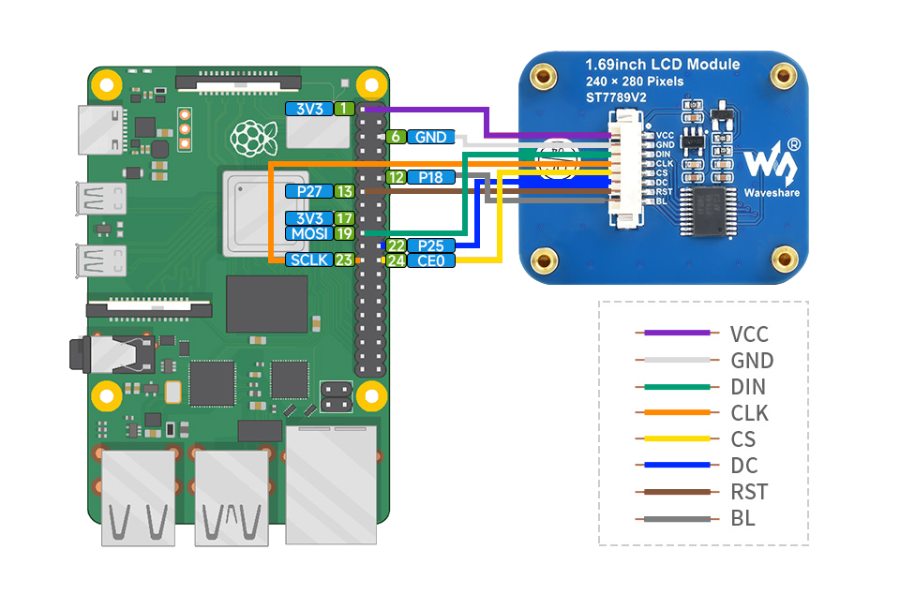

# Raspberry Pi LCD Dashboard

***Unique hardware dashboard for Raspberry Pi 4 and Raspberry Pi 5 with 3D model for Argon Neo 5 enclosure*** 

***This repository is part of the [Web3Pi](https://www.web3pi.io) initiative, which enables the automated deployment of a full Ethereum node on a Raspberry Pi.***

This project allows you to install a color LCD display in the Argon Neo 5 case and display the following system parameters:

- CPU Usage
- CPU Temperature
- RAM Usage
- SWAP Memory Usage
- Storage Usage
- IP / Hostname
- Network Traffic (eth0/WiFi)

We have designed our own 3D model of the enclosure cover with a space for the display. The assembly is simple, using snap-fits, with no tools required. The models are open-source, so anyone can print them on a 3D printer. The source code is also open-source, allowing users to add new functionalities, customize it to their needs, or add support for new displays.

<p align="center">
  
</p>


## Requirements

- Python >= 3.9
- Run on Raspberry Pi 4 and 5
- Raspberry Pi OS or Ubuntu
- [SPI interface enabled](docs/EnableSPI.md)
- 1.69" LCD display with ST7789V2 Driver
  - Waveshare 24382 - [product page](https://www.waveshare.com/1.69inch-lcd-module.htm)
  - Seeed Studio 104990802 - [product page](https://www.seeedstudio.com/1-69inch-240-280-Resolution-IPS-LCD-Display-Module-p-5755.html)
- (Optional) 3D printed model of Argon Neo 5 cover
- (Optional) Argon Neo 5 enclosure


## Assembly

### 1. Connect wires
Connect the display to the Raspberry Pi according to the diagram below.  
The colors of the cables may vary depending on the supplier and batch. Focus on the function and pin number, not the color.


Diagram is valid for Raspberry Pi 4 and Pi 5

If on Raspberry Pi 5 your LCD backlight is flickering connect `BL` to `3.3V PIN 17`

### 2. Mount display module

Mount the display in the printed enclosure cover. The display is held in place by four clips. Make sure all 3D printing support residues are removed and the surface to which the display adheres is flat. Install the display by sliding one side under the clips first, then pressing the other side down. Do not use excessive force to avoid damaging the display. The display should fit in easily.

Since each 3D printer may be calibrated differently, it may be necessary to adjust the scale of the 3D model in the slicer software before printing. Our prints are done on [Original Prusa i3 MK3S+](https://www.prusa3d.com/pl/produkt/drukarka-3d-original-prusa-i3-mk3s-3/).

### 3. Mount enclosure cover

Mount the enclosure cover and secure it with two screws. Make sure to arrange the cables inside the enclosure so they do not obstruct the fan and minimize interference with cooling.

## Installation

To enable the display, the SPI interface must be enabled.  
To do this, execute the following command and then reboot the device:

```shell
sudo sed -i '/^#dtparam=spi=on/s/^#//' /boot/firmware/config.txt
sudo reboot
```

Download the repository.

```shell
sudo apt-get -y install git
git clone https://github.com/Web3-Pi/raspberry-pi-lcd-dashboard.git
```

Then, you can run the program as a service. The program will start automatically with the system startup.  
Alternatively, you can run it once. The program will stop when you close the console.

### Run as a service - (recommended)   

```shell
cd raspberry-pi-lcd-dashboard
chmod +x *.sh
sudo ./create_service.sh
```

To **stop** the program, execute `sudo systemctl stop dashboard.service`

To **uninstall** the service, execute `sudo ./remove_service.sh`

### or run one time

If you do not want to run the program as a service, you can run it once.   
Note: Do not use both methods simultaneously.

```shell
cd raspberry-pi-lcd-dashboard
chmod +x *.sh
sudo ./run.sh
```
To stop the program, press Ctrl+C.

## Customisation

In the file `dashboard.py`, there is a flag `SHOW_PER_CORE` that determines whether the CPU usage percentage should be in the range of `0-100%` or `0-400%`.

0-400% represents the summed load of each core in the Raspberry Pi.

```python
# Choose how to display CPU usage percentages
SHOW_PER_CORE = False
# False = [0 - 100%]
# True  = [0 - 400%]
```
note: Restart the service after making changes.   
```shell
sudo systemctl restart dashboard.service
```


## 3D Model

The models are free, so anyone can print them on a 3D printer.


Download 3D model: [3D_Model](docs/3D_Model)

## 3D Printing

We recommend printing with [PETG](https://botland.store/849-petg-filaments?manufacturers=devil-design,prusa&weight=1000-g&material=petg&diameter=1-75-mm) filament due to the high operating temperatures of the Raspberry Pi.  
To ensure the snap-fits print correctly, enable 'supports everywhere.'  
Use a 0.4 mm nozzle.  
0.2 mm layer height or smaller.  
Our models are printed on [Original Prusa i3 MK3S+](https://www.prusa3d.com/pl/produkt/drukarka-3d-original-prusa-i3-mk3s-3/)

If you do not have access to a 3D printer, you can order an online print from one of the providers such as [JLC3DP](https://jlc3dp.com/3d-printing-quote).   
There are various materials technology and you can choose from:
- FDM - ABS, ASA or PA12-CF
- MJF - PA16-HP Nylon
- SLS - 3201PA-F Nylon

