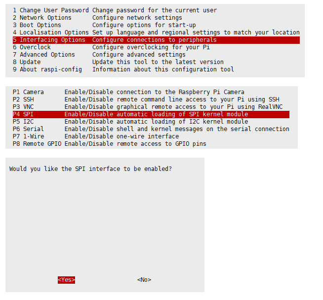
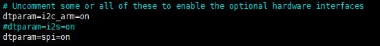
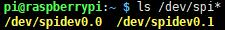

# Enable SPI Interface

* Open the terminal, use the command to enter the configuration page:

```
sudo apt-get install raspi-config
sudo raspi-config
```

Choose Interfacing Options -> SPI -> Yes  to enable SPI interface



Reboot Raspberry Pi：

```
sudo reboot
```

* Check /boot/config.txt and you can see that 'dtparam=spi=on' has been written.



* To make sure that the SPI is not occupied, it is recommended that other driver overrides be turned off for now. You can use ls /dev/spi* to check the SPI occupancy. The terminal output /dev/spidev0.0 and /dev/spidev0.1 indicates that the SPI status is normal.

